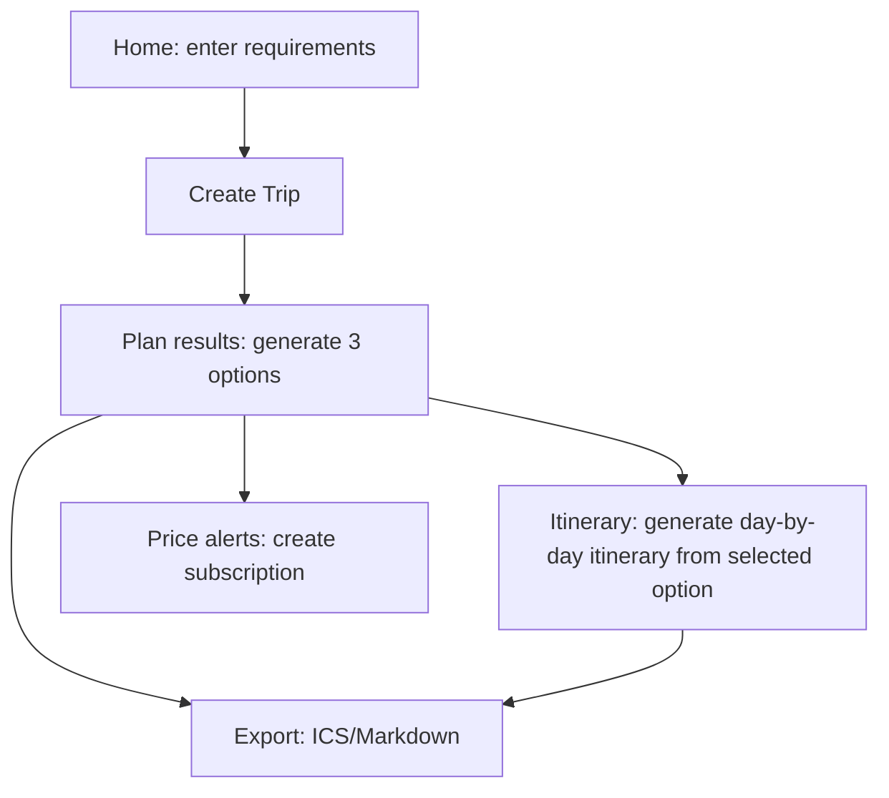

## 1. Product overview
TripSmith is a travel planning copilot: you enter basic trip details and preferences, the system generates 3 explainable options, and you can further generate a day-by-day itinerary and exports.
This addendum fixes inconsistencies across docs (pages/information architecture/terminology/implementation scope) and outputs an aligned MVP.

## 2. Core features

### 2.1 User roles
| Role | Sign-up | Core permissions |
|------|----------|----------|
| Guest (anonymous) | Anonymous session by default (generate user_id locally; or use anonymous login if integrating Supabase Auth) | Can create/view own Trips, generate plans and itineraries, export, subscribe to alerts |

### 2.2 Modules (aligned minimal page set)
1. **Home**: trip requirement form, validation and submission, examples/notes.
2. **Plan results**: Trip summary, generate/refresh 3 options, subscribe to price alerts, export entry points.
3. **Itinerary**: generate day-by-day itinerary from a selected option, view with error retry, export entry points.

### 2.3 Page details
| Page | Module | Description |
|---|---|---|
| Home | Requirements form | Enter origin/destination/date range/budget/travelers/preferences; validate required fields and date legality; submit to create a Trip and navigate to results |
| Home | Session state | Generate and store an anonymous user_id (cookie/localStorage); provide “Reset session” to clear local data |
| Plan results | Trip summary | Show submitted core constraints (locations/dates/budget/travelers/preference tags) |
| Plan results | Generate plans | Trigger generation of 3 options (budget/time/balanced); show loading and understandable errors; support “Regenerate” |
| Plan results | Plan cards | Show each option’s key summary and scoring reasons (structured metrics + short explanation); select one to enter itinerary page |
| Plan results | Price alert subscription | Enter alert type/threshold/frequency and create a subscription; show “Subscribed” state afterward (MVP may only record without real push) |
| Plan results | Export | Export ICS (calendar) and Markdown (plan doc) (MVP allows client-side generation/download) |
| Itinerary | Generate itinerary | Generate a day-by-day itinerary based on selected option (morning/afternoon/evening); show POIs, stay time, commute mode/duration, weather summary (can be mock) |
| Itinerary | Error handling | On generation failure show error + “Retry”; keep last successful result for rollback |
| Itinerary | Export | Export ICS/Markdown (same as results page) |

## 3. Core flow
- Fill in requirements on the home page and submit; the system creates a Trip.
- Generate 3 options on the plan results page and choose one.
- Generate a day-by-day itinerary on the itinerary page; export ICS/Markdown; optionally subscribe to price alerts on the results page.

---

### Alignment summary (for merging)
- Page hierarchy: remove “export as a standalone page”; export becomes a module inside results/itinerary pages.
- Page naming: the itinerary page only carries itinerary content (no “settings/provider connection” copy).
- MVP scope: price alerts can be “record subscription + UI state only” in MVP; real notifications can be iterated later.
