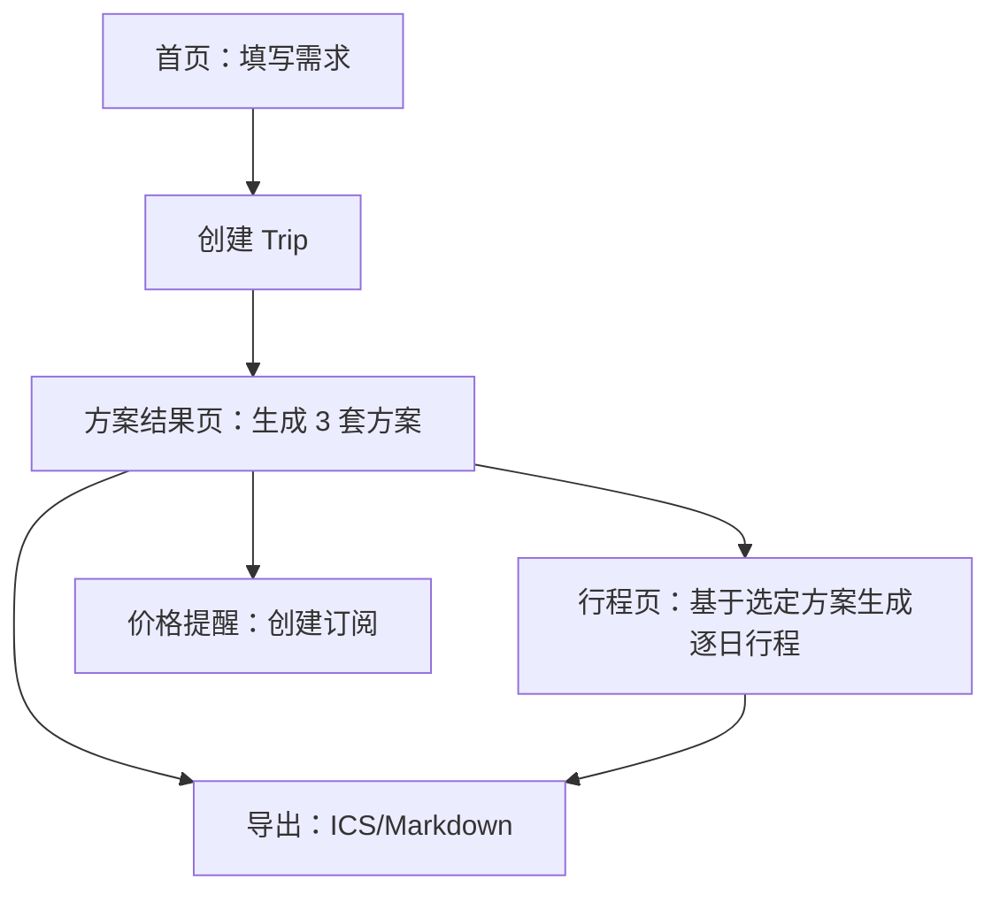

## 1. 产品概述
TripSmith 是一个旅行规划 Copilot：你输入基本出行信息与偏好，系统生成 3 套可解释方案，并可进一步生成逐日行程与导出。
本增补用于修正文档内“页面/信息架构/术语/实现边界”不一致处，输出对齐版 MVP。

## 2. 核心功能

### 2.1 用户角色
| 角色 | 注册方式 | 核心权限 |
|------|----------|----------|
| 游客（匿名） | 默认匿名会话（本地生成 user_id；如接入 Supabase Auth 则用匿名登录） | 可创建/查看自己的 Trip、生成方案与行程、导出、订阅提醒 |

### 2.2 功能模块（对齐后的最小页面集）
1. **首页**：旅行需求表单、校验与提交、示例/说明。
2. **方案结果页**：Trip 摘要、生成/刷新 3 套方案、订阅价格提醒、导出入口。
3. **行程页**：基于选定方案生成逐日行程、查看与错误重试、导出入口。

### 2.3 页面详情
| 页面名称 | 模块名称 | 功能描述 |
|---|---|---|
| 首页 | 需求表单 | 录入出发地/目的地/日期范围/预算/人数/偏好；校验必填与日期合法性；提交创建 Trip 并跳转结果页 |
| 首页 | 会话状态 | 生成并保存匿名 user_id（cookie/localStorage）；提供“重置会话”以清空本地数据 |
| 方案结果页 | Trip 摘要 | 展示已提交的核心条件（地点/日期/预算/人数/偏好标签） |
| 方案结果页 | 生成方案 | 触发生成 3 套方案（省钱/省时间/平衡）；展示加载与可理解错误；支持“重新生成” |
| 方案结果页 | 方案卡片 | 展示每套方案的关键摘要与评分理由（结构化指标 + 简短解释）；选择某套进入行程页 |
| 方案结果页 | 价格提醒订阅 | 录入提醒类型/阈值/频率并创建订阅；创建后展示“已订阅”状态（MVP 可仅记录，不强制实现真实推送） |
| 方案结果页 | 导出 | 导出 ICS（日历）与 Markdown（计划书）（MVP 允许客户端即时生成/下载） |
| 行程页 | 生成行程 | 基于选定方案生成逐日 itinerary（上午/下午/晚上）；展示 POI、停留时间、通勤方式与时长、天气摘要（可为 mock） |
| 行程页 | 异常处理 | 生成失败时展示错误与“重试”；保留上次成功结果以便回退 |
| 行程页 | 导出 | 导出 ICS/Markdown（与结果页一致） |

## 3. 核心流程
- 你在首页填写需求并提交，系统创建 Trip。
- 你在方案结果页生成 3 套方案，选择其中一套。
- 你进入行程页生成逐日行程；可导出 ICS/Markdown；可在结果页订阅价格提醒。

---

### 对齐修正摘要（便于你合并）
- 页面层级：移除“导出作为独立页面”的表述，导出改为结果页/行程页内模块。
- 页面命名：行程页仅承载 itinerary（不再出现“设置/Provider 连接”类文案）。
- MVP 边界：价格提醒在 MVP 阶段允许“仅记录订阅 + UI 状态”，真实通知可后续迭代。