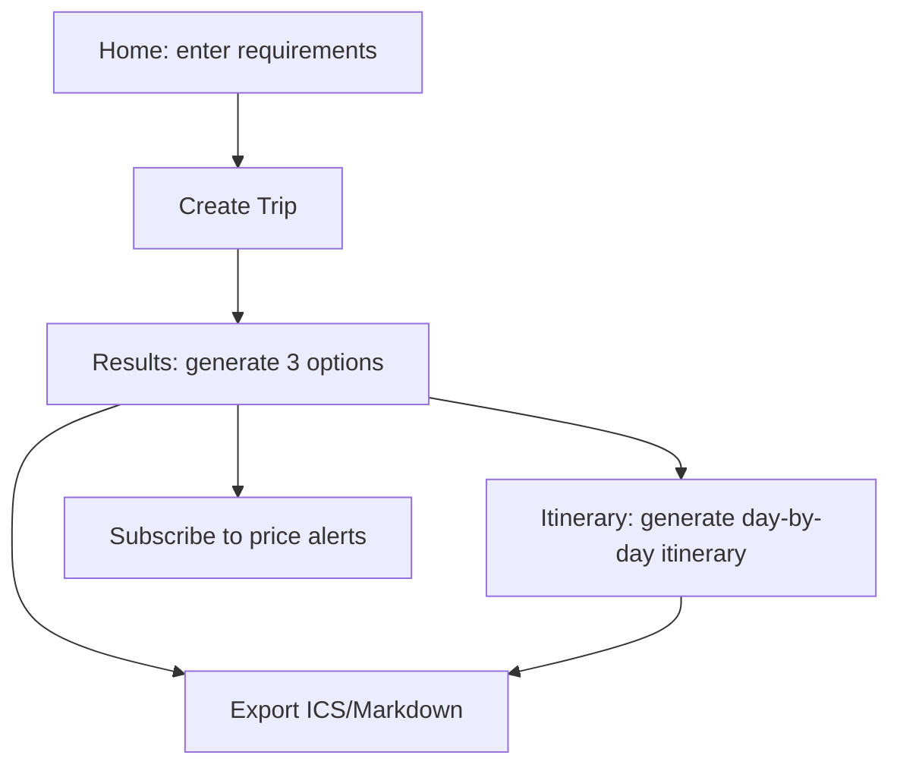

## 1. Product overview
TripSmith is an open-source travel planning copilot: enter origin/destination/dates/budget/preferences, the system retrieves candidate data via pluggable providers (flights/stays/POI/weather/routing), then an agent generates at least 3 explainable options (budget/time/balanced). You can further generate a day-by-day itinerary, export it, and subscribe to price alerts.

## 2. Core capabilities (must work end-to-end)

### 2.1 Users and identity
- MVP does not implement a full account system. It stores an anonymous `user_id` in a cookie and sends it in request headers to isolate data.
- Can be extended to real auth later (without changing the current data model).

### 2.2 Pages and flow
Core pages:
1. **Home**: trip requirement form (origin, destination, dates, flex days, budget, travelers, preferences).
2. **Results**: show 3 options (budget/time/balanced) and support subscribing to price alerts.
3. **Itinerary**: generate a day-by-day itinerary (morning/afternoon/evening) from a selected option, including POIs, stay duration, commute mode/duration, and weather summary.
4. **Export**: ICS (calendar) and Markdown (plan doc).

### 2.3 Key interactions and states
- Form validation: missing fields and invalid dates should be clearly communicated.
- Loading: show loading states for creating trips, generating plans, generating itineraries, and export links.
- Error handling: frontend failures show understandable messages and provide retry (exponential backoff up to 2 times).
- Mobile: form and plan cards stack into a single column on narrow screens.
- Price alerts: show a “Subscribed” state on the results page after subscribing.

## 3. Primary user flow
1) Enter requirements on Home → create Trip.
2) Generate plan on Results → get 3 options (structured JSON + explanation Markdown).
3) Choose an option → generate day-by-day itinerary.
4) Export ICS/Markdown or subscribe to price alerts.

## 4. Success criteria (MVP)
- With no external keys (mock providers + mock LLM), the full stack starts via `docker-compose up` and completes: create Trip → generate Plan → generate Itinerary → export ICS/Markdown → create Alert → background task produces Notification (simulated via logs).
