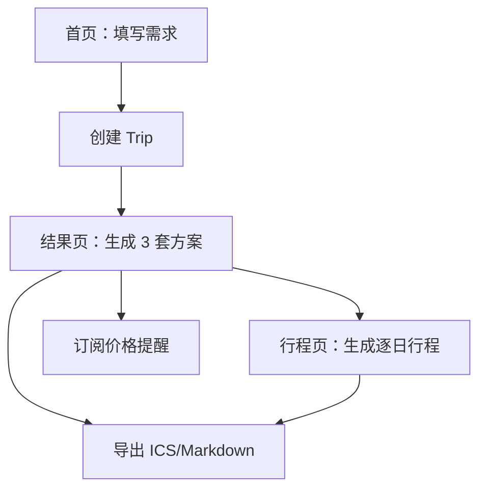

## 1. 产品概述
TripSmith 是一个开源旅行规划 Copilot：输入出发地/目的地/日期/预算/偏好，系统通过可插拔 Provider（航班/住宿/POI/天气/路径）检索候选数据，再由 Agent 按“省钱/省时间/平衡”生成至少 3 套可解释方案，并可进一步生成逐日行程、导出与订阅价格提醒。

## 2. 核心能力（必须可跑通端到端）

### 2.1 用户与身份
- 首期不做完整账号体系，使用匿名 `user_id` 存 Cookie，并在请求头携带用于隔离数据。
- 后续可扩展为真实登录（不影响当前数据模型）。

### 2.2 页面与流程
TripSmith 的核心页面：
1. **首页**：旅行需求表单（origin, destination, dates, flexible dates, budget, travelers, preferences）。
2. **结果页**：展示 3 套方案（省钱/省时间/平衡），并支持订阅价格提醒。
3. **行程页**：基于选中方案生成逐日 itinerary（上午/下午/晚上），含 POI、停留时间、通勤方式与时长、天气摘要。
4. **导出**：ICS（日历）与 Markdown（计划书）。

### 2.3 关键交互与状态
- 表单校验：缺失字段与日期不合法要清晰提示。
- Loading：创建 trip、生成 plan、生成 itinerary、导出链接均显示加载状态。
- 错误处理：前端请求失败应显示可理解的错误信息，并提供重试（指数退避最多 2 次）。
- 移动端：表单与方案卡片在窄屏下单列堆叠。
- 价格提醒：订阅后在结果页展示“已订阅”状态。

## 3. 用户主流程
1) 首页填写需求 → 创建 Trip。
2) 在结果页触发生成 Plan → 获得 3 套方案（结构化 JSON + explain Markdown）。
3) 选择其中一套方案 → 生成逐日 Itinerary。
4) 导出 ICS/Markdown 或订阅价格提醒。

## 4. 成功标准（MVP）
- 无任何外部 Key 的情况下（Mock Providers + LLM mock），可通过 `docker-compose up` 启动全站，并完成：创建 Trip → 生成 Plan → 生成 Itinerary → 导出 ICS/Markdown → 创建 Alert → 后台任务产出 Notification（日志模拟发送）。
