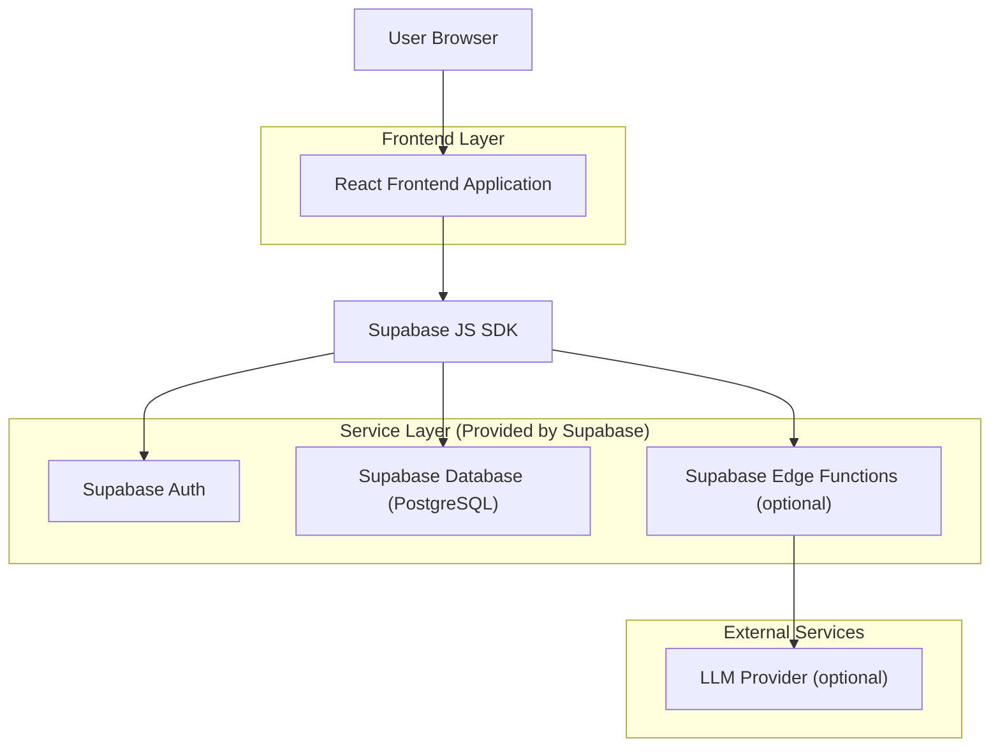
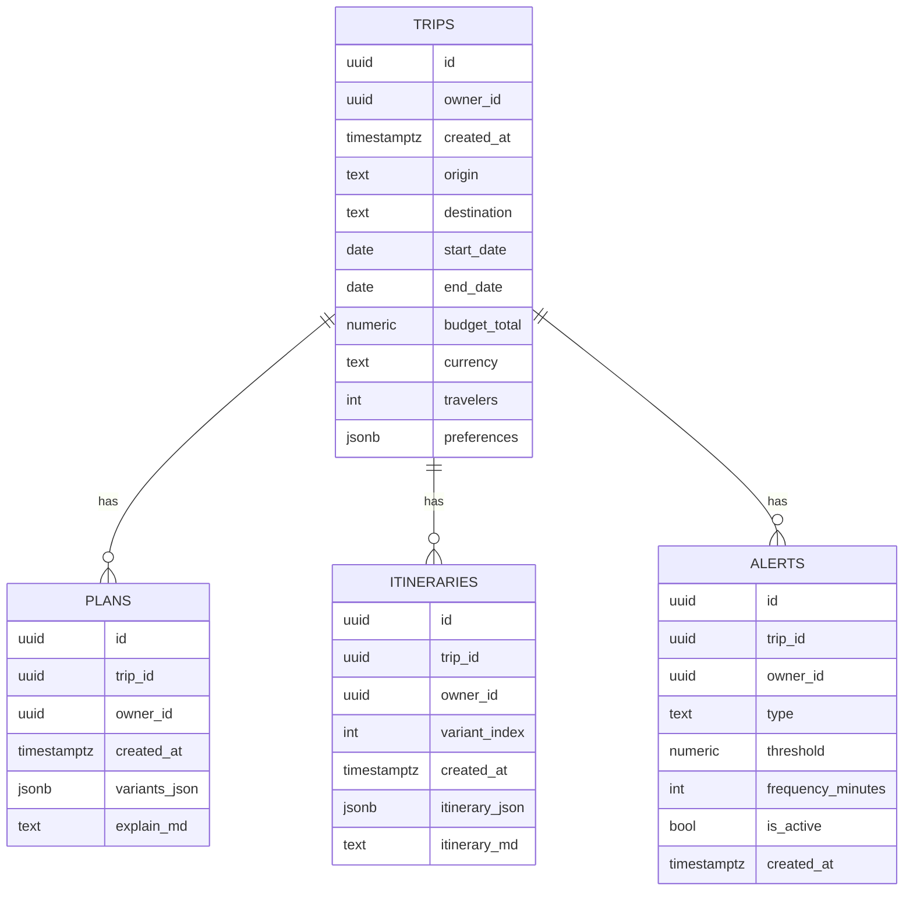

## 1.Architecture design


## 2.Technology Description
- Frontend: React@18 + TypeScript + vite + tailwindcss@3
- Backend: Supabase (Auth + Postgres + Edge Functions (optional))

## 3.Route definitions
| Route | Purpose |
|---|---|
| / | Home: enter trip requirements and create a Trip |
| /trips/:id | Results: generate and show 3 options, subscribe to alerts, export |
| /trips/:id/itinerary | Itinerary: generate and view day-by-day itinerary, export |

## 4.API definitions (If it includes backend services)
> Enable only when you need to safely call a real LLM (without exposing API keys to the frontend). Otherwise, the frontend can use mocks to generate results.

### 4.1 Core API（Supabase Edge Functions）
```
POST /functions/v1/generate-plan
POST /functions/v1/generate-itinerary
```

共享 TypeScript 类型（前端与 Edge Functions 共用）
```ts
export type TripInput = {
  origin: string;
  destination: string;
  startDate: string; // YYYY-MM-DD
  endDate: string;   // YYYY-MM-DD
  flexibleDays?: number;
  budgetTotal?: number;
  currency?: string;
  travelers?: number;
  preferences?: Record<string, unknown>;
};

export type PlanVariant = {
  title: "Budget" | "Time-saver" | "Balanced";
  summary: string;
  metrics: { totalCost?: number; totalTravelHours?: number; transfers?: number };
};
```

## 6.Data model(if applicable)

### 6.1 Data model definition


### 6.2 Data Definition Language
> Avoid physical foreign key constraints; use logical keys (trip_id/owner_id) with RLS.

TRIPS
```
CREATE TABLE trips (
  id uuid PRIMARY KEY DEFAULT gen_random_uuid(),
  owner_id uuid NOT NULL,
  created_at timestamptz NOT NULL DEFAULT now(),
  origin text NOT NULL,
  destination text NOT NULL,
  start_date date NOT NULL,
  end_date date NOT NULL,
  budget_total numeric NULL,
  currency text NULL,
  travelers int NULL,
  preferences jsonb NOT NULL DEFAULT '{}'::jsonb
);

ALTER TABLE trips ENABLE ROW LEVEL SECURITY;

-- Allow anonymous reads (optional; recommended: authenticated only)
GRANT SELECT ON trips TO anon;
GRANT ALL PRIVILEGES ON trips TO authenticated;

-- authenticated can only access its own data
CREATE POLICY "trips_owner_select" ON trips
  FOR SELECT TO authenticated
  USING (owner_id = auth.uid());
CREATE POLICY "trips_owner_write" ON trips
  FOR ALL TO authenticated
  USING (owner_id = auth.uid())
  WITH CHECK (owner_id = auth.uid());
```

PLANS / ITINERARIES / ALERTS (same structure: owner_id + trip_id; same policies as trips)
```
-- Repeated DDL omitted: enable RLS the same way as trips;
-- Policies enforce reads/writes by owner_id = auth.uid().
```

---

### 对齐修正摘要（便于你合并）
### Alignment summary (for merging)
- Stack narrowing: from “Next.js + FastAPI + Postgres/Redis/Celery” to “React + Supabase (Auth/DB/Edge Functions optional)” to reduce MVP infrastructure complexity.
- Security boundary: introduce Edge Functions only when you need a real LLM and must protect keys; otherwise, a pure-frontend mock can run end-to-end.
