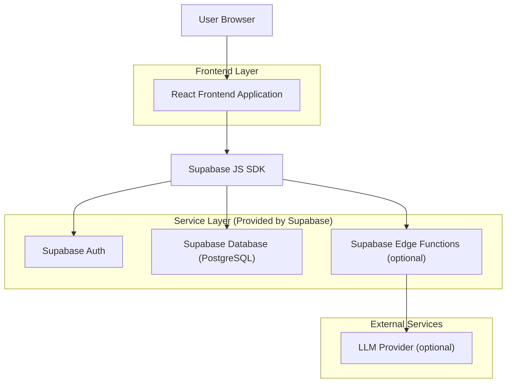
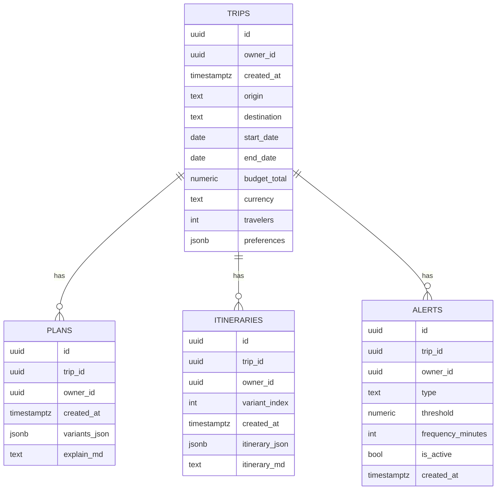

## 1.Architecture design


## 2.Technology Description
- Frontend: React@18 + TypeScript + vite + tailwindcss@3
- Backend: Supabase（Auth + Postgres + Edge Functions（可选））

## 3.Route definitions
| Route | Purpose |
|---|---|
| / | 首页：填写旅行需求并创建 Trip |
| /trips/:id | 方案结果页：生成并展示 3 套方案、订阅提醒、导出 |
| /trips/:id/itinerary | 行程页：生成并查看逐日行程、导出 |

## 4.API definitions (If it includes backend services)
> 仅当你需要安全地调用真实 LLM（不把 API Key 暴露到前端）时启用；否则可用前端 mock 生成结果。

### 4.1 Core API（Supabase Edge Functions）
```
POST /functions/v1/generate-plan
POST /functions/v1/generate-itinerary
```

共享 TypeScript 类型（前端与 Edge Functions 共用）
```ts
export type TripInput = {
  origin: string;
  destination: string;
  startDate: string; // YYYY-MM-DD
  endDate: string;   // YYYY-MM-DD
  flexibleDays?: number;
  budgetTotal?: number;
  currency?: string;
  travelers?: number;
  preferences?: Record<string, unknown>;
};

export type PlanVariant = {
  title: "省钱" | "省时间" | "平衡";
  summary: string;
  metrics: { totalCost?: number; totalTravelHours?: number; transfers?: number };
};
```

## 6.Data model(if applicable)

### 6.1 Data model definition


### 6.2 Data Definition Language
> 避免物理外键约束，使用逻辑外键（trip_id/owner_id）并配合 RLS。

TRIPS
```
CREATE TABLE trips (
  id uuid PRIMARY KEY DEFAULT gen_random_uuid(),
  owner_id uuid NOT NULL,
  created_at timestamptz NOT NULL DEFAULT now(),
  origin text NOT NULL,
  destination text NOT NULL,
  start_date date NOT NULL,
  end_date date NOT NULL,
  budget_total numeric NULL,
  currency text NULL,
  travelers int NULL,
  preferences jsonb NOT NULL DEFAULT '{}'::jsonb
);

ALTER TABLE trips ENABLE ROW LEVEL SECURITY;

-- 允许匿名读取（可选；更推荐只给 authenticated）
GRANT SELECT ON trips TO anon;
GRANT ALL PRIVILEGES ON trips TO authenticated;

-- authenticated 只能访问自己的数据
CREATE POLICY "trips_owner_select" ON trips
  FOR SELECT TO authenticated
  USING (owner_id = auth.uid());
CREATE POLICY "trips_owner_write" ON trips
  FOR ALL TO authenticated
  USING (owner_id = auth.uid())
  WITH CHECK (owner_id = auth.uid());
```

PLANS / ITINERARIES / ALERTS（同样结构，owner_id + trip_id；策略同 trips）
```
-- 省略重复 DDL：与 trips 同样启用 RLS；
-- 策略按 owner_id = auth.uid() 控制读写。
```

---

### 对齐修正摘要（便于你合并）
- 技术栈收敛：从“Next.js + FastAPI + Postgres/Redis/Celery”收敛为“React + Supabase（Auth/DB/Edge Functions 可选）”，降低 MVP 基础设施复杂度。
- 安全边界：仅当需要真实 LLM 且需保护 key 时，引入 Edge Functions；否则可纯前端 mock 跑通端到端。