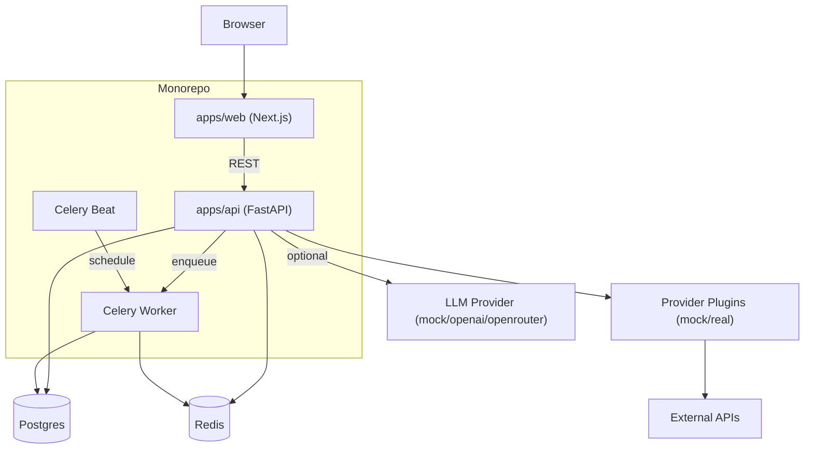
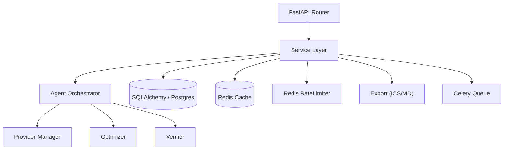
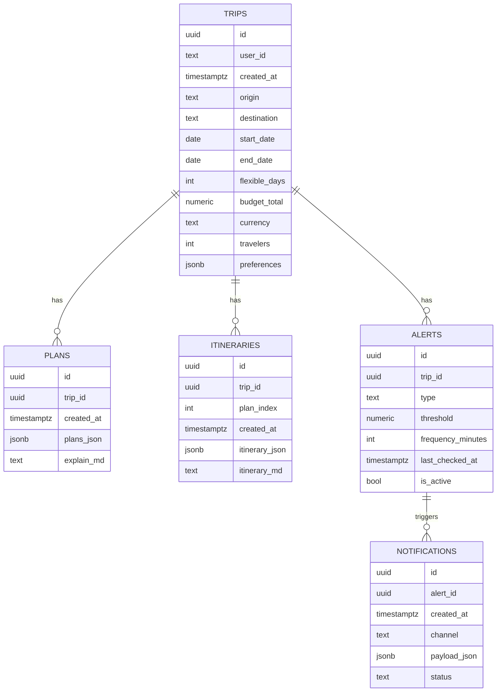

## 1. Architecture

## 2. Technology choices
- Frontend: Next.js + TypeScript + Tailwind CSS
- Backend: FastAPI + Pydantic + SQLAlchemy + Alembic
- Database: Postgres (Docker)
- Cache and rate limiting: Redis (Docker)
- Background jobs: Celery + Beat (Docker)
- Agent: multi-step reliable flow (constraint extraction → tool retrieval → plan optimization → itinerary writing → self-check)
- Typed client: `packages/shared` generates TypeScript types from FastAPI OpenAPI

## 3. Frontend routes
| Route | Purpose |
|-------|---------|
| / | Home: trip requirements form |
| /trips/[id] | Results: show 3 options |
| /trips/[id]/itinerary | Itinerary: day-by-day itinerary |

## 4. Backend API (FastAPI, prefix `/api`)

### 4.1 Endpoint list
| Method | Path | Purpose |
|--------|------|---------|
| POST | /api/trips | Create a trip (persist user input) |
| POST | /api/trips/{id}/plan | Trigger agent to generate 3 options (JSON + Markdown) |
| GET | /api/trips/{id} | Fetch trip + latest plan |
| POST | /api/trips/{id}/itinerary | Generate day-by-day itinerary from a selected plan |
| GET | /api/trips/{id}/export/ics | Export ICS |
| GET | /api/trips/{id}/export/md | Export Markdown |
| POST | /api/alerts | Create a price alert |
| GET | /api/health | Health check |

### 4.2 Error model and retries
- The backend returns a consistent error response: `{ "error": { "code": string, "message": string, "details"?: any } }`.
- The frontend retries idempotent reads and generation endpoints with exponential backoff up to 2 times; for 429 (rate limiting) it follows `Retry-After`.

## 5. API 内部模块

## 6. Data model (persisted)
### 6.1 ER diagram

### 6.2 Migration strategy
- Maintain schema via Alembic.
- Production should use stricter auth; current MVP isolates data via `user_id` (cookie/header).

## 7. Agent and provider plugins
### 7.1 Multi-step reliable flow
1) Constraint extraction: turn Trip input into hard constraints and preference parameters.
2) Tool retrieval: call providers to fetch candidate flights/stays/poi/weather/routing and cache results.
3) Plan optimization: output 3 options from candidates while satisfying budget/dates/activity duration hard constraints.
4) Itinerary writing: expand the option into a day-by-day itinerary (morning/afternoon/evening), filling commute and weather summaries.
5) Self-check: verifier checks budget, time windows, excessive commute, duplicate POIs, overpacking; on failure, roll back and optimize up to 2 times.

### 7.2 Provider plugin interfaces
- FlightsProvider / StaysProvider / PoiProvider / WeatherProvider / RoutingProvider。
- MockProvider is enabled by default so the system runs without keys; real providers must fall back when unavailable.

## 8. Deployment (Docker Compose)
- One-command bring-up: `postgres`, `redis`, `api`, `celery_worker`, `celery_beat`, `web`.
- Production suggestions: Web (Vercel/self-hosted), API (container/VM), managed Postgres/Redis, disable docs or protect them.

## 9. Test scope
- API: pytest coverage for schema validation, mock providers, optimizer, export generation, rate limiting, and caching.
- Web: at least typecheck + lint; optionally add basic component render tests.
