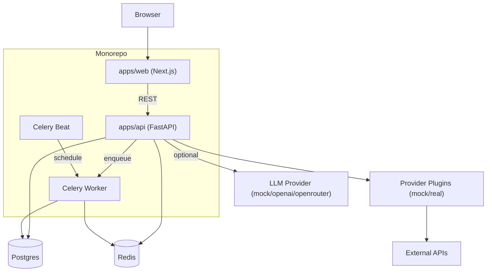
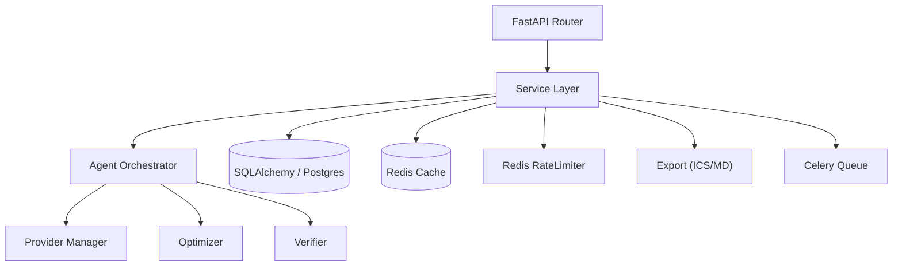
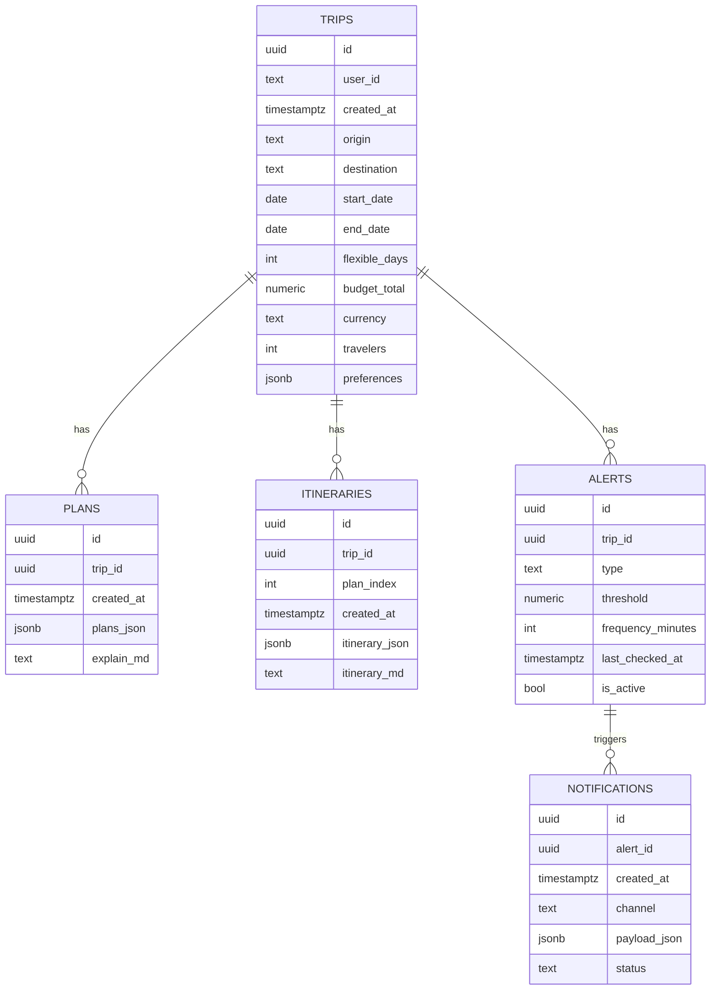

## 1. 架构设计

## 2. 技术选型
- 前端：Next.js + TypeScript + Tailwind CSS
- 后端：FastAPI + Pydantic + SQLAlchemy + Alembic
- 数据库：Postgres（Docker）
- 缓存与限流：Redis（Docker）
- 后台任务：Celery + Beat（Docker）
- Agent：多步可靠流程（约束提取 → 工具检索 → 方案优化 → 行程写作 → 自检）
- typed client：`packages/shared` 基于 FastAPI OpenAPI 生成 TypeScript 类型

## 3. 前端路由
| Route | Purpose |
|-------|---------|
| / | 首页：旅行需求表单 |
| /trips/[id] | 结果页：展示 3 套方案 |
| /trips/[id]/itinerary | 行程页：逐日行程 |

## 4. 后端 API（FastAPI，前缀 `/api`）

### 4.1 Endpoint 列表
| Method | Path | Purpose |
|--------|------|---------|
| POST | /api/trips | 创建 trip（保存用户输入） |
| POST | /api/trips/{id}/plan | 触发 agent 生成 3 套方案（JSON + Markdown） |
| GET | /api/trips/{id} | 获取 trip + 最新 plan |
| POST | /api/trips/{id}/itinerary | 基于选中方案生成逐日 itinerary |
| GET | /api/trips/{id}/export/ics | 导出 ICS |
| GET | /api/trips/{id}/export/md | 导出 Markdown |
| POST | /api/alerts | 创建价格提醒 |
| GET | /api/health | 健康检查 |

### 4.2 错误模型与重试
- 后端使用一致的错误响应：`{ "error": { "code": string, "message": string, "details"?: any } }`。
- 前端对幂等读取与生成类接口允许指数退避最多 2 次；对 429（限流）遵循 `Retry-After`。

## 5. API 内部模块

## 6. 数据模型（必须落库）
### 6.1 ER 图

### 6.2 迁移策略
- 通过 Alembic 维护 schema。
- 生产建议开启更严格的鉴权；当前 MVP 以 `user_id`（cookie/header）进行数据隔离。

## 7. Agent 与 Provider 插件
### 7.1 多步可靠流程
1) 约束提取：把 Trip 输入转为硬约束与偏好参数。
2) 工具检索：调用 Provider 获取候选 flights/stays/poi/weather/routing，并写入缓存。
3) 方案优化：从候选中输出 3 套方案，满足预算/日期/活动时长等硬约束。
4) 行程写作：将方案扩展为逐日 itinerary（上午/下午/晚上），补全通勤与天气摘要。
5) 自检：Verifier 检查预算、时间窗、通勤过长、景点重复、过密；失败最多回退优化 2 次。

### 7.2 Provider 插件接口
- FlightsProvider / StaysProvider / PoiProvider / WeatherProvider / RoutingProvider。
- 默认启用 MockProvider 保证无 key 可跑通；真实 Provider 不可用时必须 fallback。

## 8. 部署（Docker Compose）
- `postgres`、`redis`、`api`、`celery_worker`、`celery_beat`、`web` 一键启动。
- 生产部署建议：Web（Vercel/自托管），API（容器/VM），Postgres/Redis 托管化，关闭 docs 或加简单保护。

## 9. 测试范围
- API：pytest 覆盖 schema 校验、mock provider、optimizer、export 生成、限流与缓存。
- Web：至少 typecheck + lint；可补充基础组件渲染测试。
